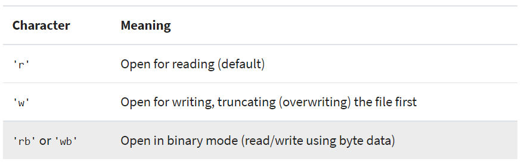

# Reading and Writing Files in Python

## What Is a File?
- A file is a contiguous set of bytes used to store data. Then its converted to binary mode (0,1) to make i readable for the computer

## File Paths
- The file path is a string that represents the location of a file

## Opening and Closing a File in Python
- When you want to work with a file, the first thing to do is to open it. This is done by invoking the "**open()**" built-in function. like:

```
file = open('my_file.txt')
```
- After you open a file, the next thing to learn is how to close it. The first way to close a file is to use the **try-finally** block:

- The second way to close a file is to use the with statement:
``` 
with open('dog_breeds.txt') as reader:
    # Further file processing goes here
```
- below explains that we can open a file with different modes.



# Python Exceptions
## Syntax errors
- Syntax errors occur when the parser detects an incorrect statement. Observe the following example:
```
>>> print( 0 / 0 ))
  File "<stdin>", line 1
    print( 0 / 0 ))
                  ^
SyntaxError: invalid syntax
```
## Raising an Exception
- We can use **raise** to throw an exception if a condition occurs. The statement can be complemented with a custom exception

## The AssertionError Exception
- By making an assertion in Python. We assert that a certain condition is met.

## The try and except Block: Handling Exceptions
- The try and except block in Python is used to catch and handle exceptions. Python executes code following the try statement as a “normal” part of the program. The code that follows the except statement is the program’s response to any exceptions in the preceding try clause.

## The else Clause
- In Python, using the else statement, you can instruct a program to execute a certain block of code only in the absence of exceptions.

  

## Cleaning Up After Using finally
- i i wanna clean up after executing your code. Python enables you to do so using the finally clause.


