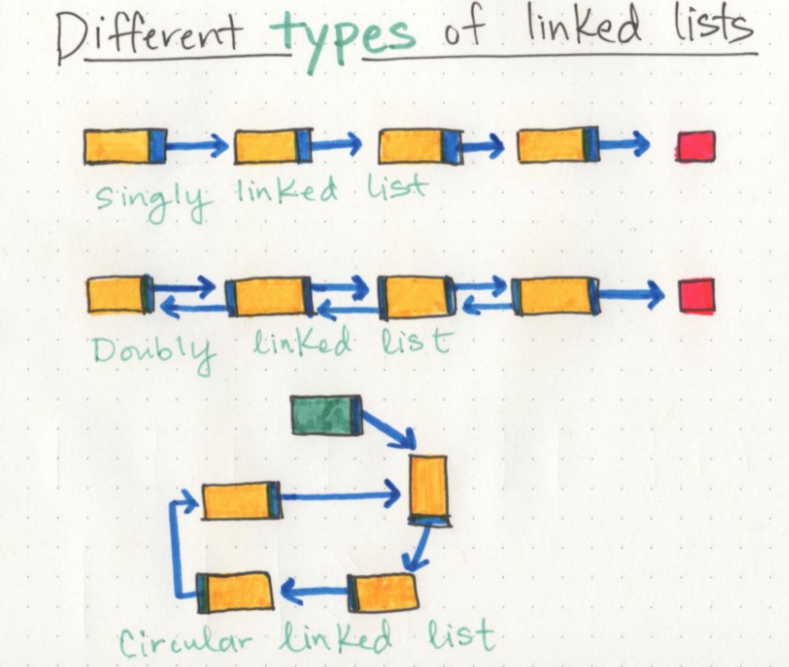
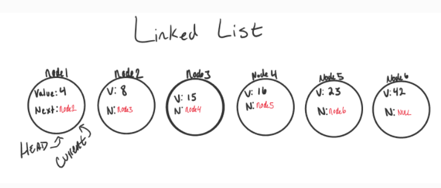

# Teach
- WHAT is OOB: object-oriented Programming (OOPs) is a programming paradigm that uses objects and classes in programming. It aims to implement real-world entities like inheritance, polymorphisms, encapsulation, etc. in the programming

- WHY we use OOB: Defining classes with attributes and methods, which you will then call. Python offers a number of benefits compared to other programming languages

- HOW we use OOB: by structuring a program by bundling related properties and behaviors into individual objects. 


# Linked Lists
- Linked List:  `linear` data structure that contains nodes that links/points to the next node in the list, Also, Linked List is a sequence of Nodes that are connected/linked to each other. The most defining feature of a Linked List is that each Node references the next Node in the link.

- There are two types of Linked List - `Singly` and `Doubly` and `circular`


- `Singly` refers to the number of references the node has. A Singly linked list means that there is only one reference, and the reference points to the Next node in a linked list.

- `Doubly` refers to there being two (double) references within the node. A A `Doubly` linked list means that there is a `reference` to both the `Next` and `Previous` node.

- `Nodes` are the individual items/links that live in a linked list. Each node contains the data for each link, Each `node` contains a property called `Next`. This property contains the reference to the `next` node.

- The `Head` is a reference of type Node to `the first node` in a linked list.

- The `Current` is a `reference` of type `Node` to the node that is currently being `looked at`. When traversing, you create a new `Current` variable at the `Head` to guarantee you are starting `from the beginning of the linked list.`

   

## Traversal
- The best way to approach a traversal is through the use of a `while() loop`. This allows us to continually check that the `Next node in the list is not null`. If we accidentally end up trying to traverse on a node that is null, a `NullReferenceException` gets thrown and our program will crash/end.

- Traversal Example: 

```
LGORITHM Includes (value)
// INPUT <-- integer value
// OUTPUT <-- boolean

  Current <-- Head

  WHILE Current is not NULL
    IF Current.Value is equal to value
      return TRUE

    Current <-- Current.Next

  return FALSE

```

- A node only knows about what data it contains, and who its neighbor is,  single node doesn’t know how long the linked list is, and it may not necessarily even know where it starts, or where it ends. All a node is concerned with is the data it contains, and which node its pointer references to — the next node in the list.


