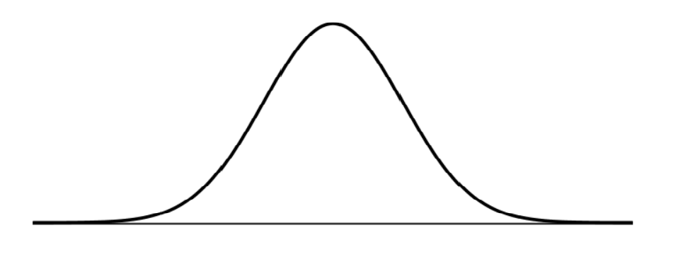

# Enriching Your Python Classes With Dunder (Magic, Special) Methods

- n Python, special methods are a set of predefined methods you can use to enrich your classes. They are easy to recognize because they start and end with double underscores, for example __init__ or __str__.

- As it quickly became tiresome to say under-under-method-under-under Pythonistas adopted the term “dunder methods”, a short form of “double under.”

- These “dunders” or “special methods” in Python are also sometimes called “magic methods.” But using this terminology can make them seem more complicated than they really are—at the end of the day there’s nothing “magical” about them. You should treat these methods like a normal language feature.

- Dunder methods let you emulate the behavior of built-in types. For example, to get the length of a string you can call len('string'). But an empty class definition doesn’t support this behavior out of the box:
```
class NoLenSupport:
    pass

>>> obj = NoLenSupport()
>>> len(obj)
TypeError: "object of type 'NoLenSupport' has no len()"
To fix this, you can add a __len__ dunder method to your class:

class LenSupport:
    def __len__(self):
        return 42

>>> obj = LenSupport()
>>> len(obj)
42

```

## Object Initialization: __init__
- To construct account objects from the Account class I need a constructor which in Python is the `__init__` dunder:
```
class Account:
    """A simple account class"""

    def __init__(self, owner, amount=0):
        """
        This is the constructor that lets us create
        objects from this class
        """
        self.owner = owner
        self.amount = amount
        self._transactions = []

```
## Object Representation: __str__, __repr__
- it’s common practice in Python to provide a string representation of your object for the consumer of your class (a bit like API documentation.) There are two ways to do this using dunder methods:

- `__repr__`: The “official” string representation of an object. This is how you would make an object of the class. The goal of __repr__ is to be unambiguous.

- `__str__`: The “informal” or nicely printable string representation of an object. This is for the enduser.

```
class Account:
    # ... (see above)

    def __repr__(self):
        return 'Account({!r}, {!r})'.format(self.owner, self.amount)

    def __str__(self):
        return 'Account of {} with starting amount: {}'.format(
            self.owner, self.amount
```
## Iteration: `__len__`, `__getitem__`, `__reversed__`
- In order to iterate over our account object I need to add some transactions. So first, I’ll define a simple method to add transactions. I’ll keep it simple because this is just setup code to explain dunder methods, and not a production-ready accounting system:
```
def add_transaction(self, amount):
    if not isinstance(amount, int):
        raise ValueError('please use int for amount')
    self._transactions.append(amount)
```
## Basic Statistics in Python — Probability

- At the most basic level, probability seeks to answer the question, “What is the chance of an event happening?” An event is some outcome of interest. To calculate the chance of an event happening, we also need to consider all the other events that can occur. The quintessential representation of probability is the humble coin toss. In a coin toss the only events that can happen are:

`Flipping a heads`

`Flipping a tails`

### The data and the distribution

 
 - The most important qualities to notice about the normal distribution is its symmetry and its shape. We’ve been calling it a distribution, but what exactly is being distributed? It depends on the context. In probability, the normal distribution is a particular distribution of the probability across all of the events. The x-axis takes on the values of events we want to know the probability of. The y-axis is the probability associated with each event, from 0 to 1.
