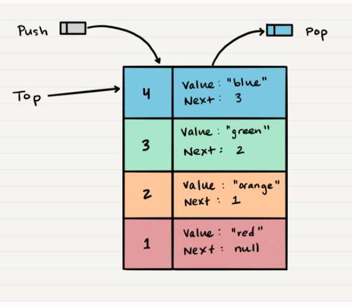
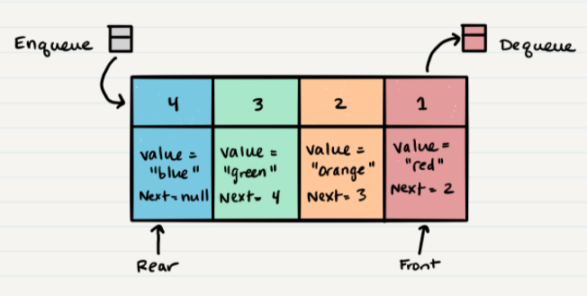

# Stacks and Queues
- `What is a Stack`
   - A stack is a data structure that consists of Nodes. Each Node references the next Node in the stack, but does not reference its previous.
   - Common terminology for a stack is
      - Push - Nodes or items that are put into the stack are pushed
       -  Pop - Nodes or items that are removed from the stack are popped. When you attempt to pop an empty stack an exception will be raised.
        - Top - This is the top of the stack.
        - Peek - When you peek you will view the value of the top Node in the stack. When you attempt to peek an empty stack an exception will be raised.
        - IsEmpty - returns true when stack is empty otherwise returns false.
    - Stacks follow these concepts:
        - `FILO`: `F`irst `I`n `L`ast `O`ut
        - `LIFO` `L`ast `I`n `F`irst `O`ut

- `Stack Visualization`
   - Here’s an example of what a stack looks like. As you can see, the topmost item is denoted as the top. When you push something to the stack, it becomes the new top. When you pop something from the stack, you pop the current top and set the next top as top.next
   

- `What is a Queue`
.
   - Common terminology for a stack is
      - Enqueue - Nodes or items that are added to the queue.
       -  Dequeue - Nodes or items that are removed from the queue. If called when the queue is empty an exception will be raised.
        - Front - This is the front/first Node of the queue
        - Rear - This is the rear/last Node of the queue.
        - Peek - When you peek you will view the value of the front Node in the queue. If called when the queue is empty an exception will be raised
        - IsEmpty - returns true when queue is empty otherwise returns false.
    - Stacks follow these concepts:
        - `FIFO`: `F`irst `I`n `F`ast `O`ut
        - `LIFO` `L`ast `I`n `L`irst `O`ut
- `Stack Visualization`
       