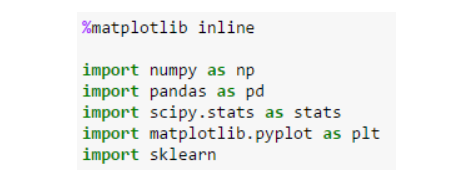

# How to run Linear regression in Python scikit-Learn
- Scikit-learn is a powerful Python module for machine learning. It contains function for regression, classification, clustering, model selection and dimensionality reduction. Today, I will explore the sklearn.linear_model module which contains “methods intended for regression in which the target value is expected to be a linear combination of the input variables”.
### Exploring Boston Housing Data Set
- The first step is to import the required Python libraries into Ipython Notebook.


- This data set is available in sklearn Python module, so I will access it using scikitlearn. I am going to import Boston data set into Ipython notebook and store it in a variable called boston

### Scikit Learn
- Scikit-learn is a free software machine learning library for the Python programming language. It features various classification, regression and clustering algorithms including support vector machines

### Fitting a Linear Model
- Two other parameters that you can pass to linear regression object are fit_intercept and normalize.
```
In [20]: lm.fit(X, bos.PRICE)

Out[20]: LinearRegression(copy_X=True, fit_intercept=True, normalize=False)
```
