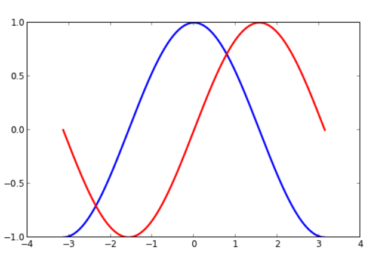

# Matplotlib 
- matplotlib is probably the single most used Python package for 2D-graphics. It provides both a very quick way to visualize data from Python and publication-quality figures in many formats. We are going to explore matplotlib in interactive mode covering most common cases.
- pyplot provides a convenient interface to the matplotlib object-oriented plotting library. It is modeled closely after Matlab(TM). Therefore, the majority of plotting commands in pyplot have Matlab(TM) analogs with similar arguments. Important commands are explained with interactive examples.

### Simple plot
- we want to draw the cosine and sine functions on the same plot.
- The first step is to get the data for the sine and cosine functions:
```
import numpy as np

X = np.linspace(-np.pi, np.pi, 256, endpoint=True)
C, S = np.cos(X), np.sin(X)
```
- X is now a NumPy array with 256 values ranging from -π to +π (included). C is the cosine (256 values) and S is the sine (256 values).
### Changing colors and line widths

- As a first step, we want to have the cosine in blue and the sine in red and a slightly thicker line for both of them. We'll also slightly alter the figure size to make it more horizontal.
```
plt.figure(figsize=(10,6), dpi=80)
plt.plot(X, C, color="blue", linewidth=2.5, linestyle="-")
plt.plot(X, S, color="red",  linewidth=2.5, linestyle="-")
```
### Moving spines
- Spines are the lines connecting the axis tick marks and noting the boundaries of the data area. They can be placed at arbitrary positions and until now, they were on the border of the axis. We'll change that since we want to have them in the middle. Since there are four of them (top/bottom/left/right), we'll discard the top and right by setting their color to none and we'll move the bottom and left ones to coordinate 0 in data space coordinates.

### Adding a legend
```
plt.plot(X, C, color="blue", linewidth=2.5, linestyle="-", label="cosine")
plt.plot(X, S, color="red",  linewidth=2.5, linestyle="-", label="sine")

plt.legend(loc='upper left', frameon=False)
```