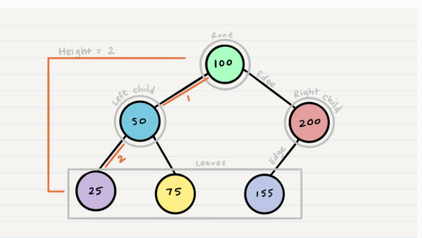

# Teach
- What is Stacks and queues?
    - Stack is a container of objects that are inserted and removed according to the last-in first-out (LIFO) principle. Queue is a container of objects (a linear collection) that are inserted and removed according to the first-in first-out (FIFO) principle.
- why we use them ?
    - Stacks are very useful for it's backtracking features. For example, parsing questions tend to use stacks because of the LIFO property. Stacks can be used to implement recursive solutions iteratively. Queues are useful when the ordering of the data matters as it preserves that ordering.

- how we use them ?
    - Use a queue when you want to get things out in the order that you put them in.
    - Use a stack when you want to get things out in the reverse order than you put them in.  

## Trees
- Node - A Tree node is a component which may contain it’s own - values, and references to other nodes
- Root - The root is the node at the beginning of the tree
- K - A number that specifies the maximum number of children any - node may have in a k-ary tree. In a binary tree, k = 2.
- Left - A reference to one child node, in a binary tree
- Right - A reference to the other child node, in a binary tree
- Edge - The edge in a tree is the link between a parent and child - node
- Leaf - A leaf is a node that does not have any children
- Height - The height of a tree is the number of edges from the - root to the furthest leaf

## What is Tree?
- A tree data structure is a non-linear data structure because it does not store in a sequential manner. It is a hierarchical structure as elements in a Tree are arranged in multiple levels. In the Tree data structure, the topmost node is known as a root node. Each node contains some data, and data can be of any type.