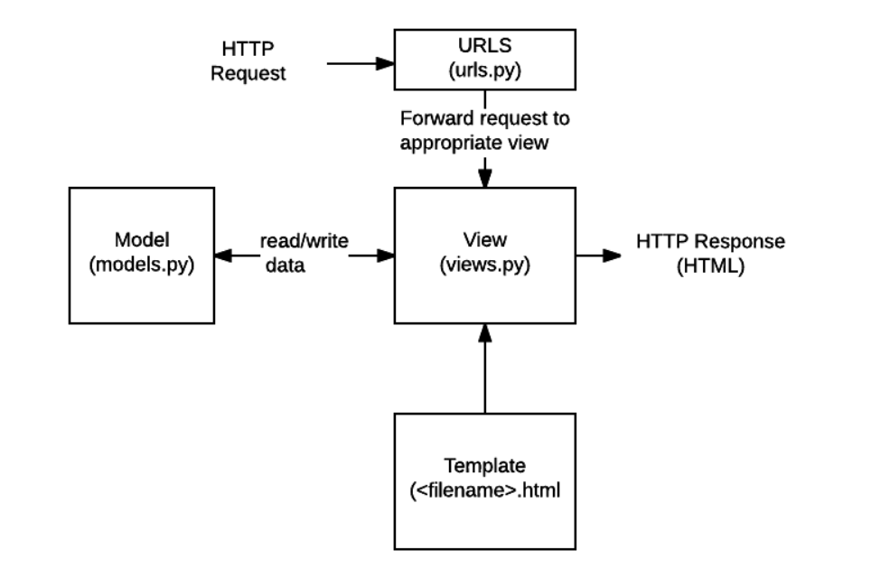

# `What is Django?`
- Django is a high-level Python web framework that enables rapid development of secure and maintainable websites. Built by experienced developers, Django takes care of much of the hassle of web development, so you can focus on writing your app without needing to reinvent the wheel. It is free and open source, has a thriving and active community, great documentation, and many options for free and paid-for support.

## `Where did it come from?`
- Django was initially developed between 2003 and 2005 by a web team who were responsible for creating and maintaining newspaper websites. After creating a number of sites, the team began to factor out and reuse lots of common code and design patterns. This common code evolved into a generic web development framework, which was open-sourced as the "Django" project in July 2005.

- Django has continued to grow and improve, from its first milestone release (1.0) in September 2008 through to the recently-released version 3.1 (2020). Each release has added new functionality and bug fixes, ranging from support for new types of databases, template engines, and caching, through to the addition of "generic" view functions and classes (which reduce the amount of code that developers have to write for a number of programming tasks).

## `What does Django code look like?`
- In a traditional data-driven website, a web application waits for HTTP requests from the web browser (or other client). When a request is received the application works out what is needed based on the URL and possibly information in POST data or GET data. Depending on what is required it may then read or write information from a database or perform other tasks required to satisfy the request. The application will then return a response to the web browser, often dynamically creating an HTML page for the browser to display by inserting the retrieved data into placeholders in an HTML template.

- Django web applications typically group the code that handles each of these steps into separate files:

- 

- `URLs`: While it is possible to process requests from every single URL via a single function, it is much more maintainable to write a separate view function to handle each resource. A URL mapper is used to redirect HTTP requests to the appropriate view based on the request URL. The URL mapper can also match particular patterns of strings or digits that appear in a URL and pass these to a view function as data.
- `View`: A view is a request handler function, which receives HTTP requests and returns HTTP responses. Views access the data needed to satisfy requests via models, and delegate the formatting of the response to templates.
Models: Models are Python objects that define the structure of an application's data, and provide mechanisms to manage (add, modify, delete) and query records in the database.
- `Templates`: A template is a text file defining the structure or layout of a file (such as an HTML page), with placeholders used to represent actual content. A view can dynamically create an HTML page using an HTML template, populating it with data from a model. A template can be used to define the structure of any type of file; it doesn't have to be HTML!