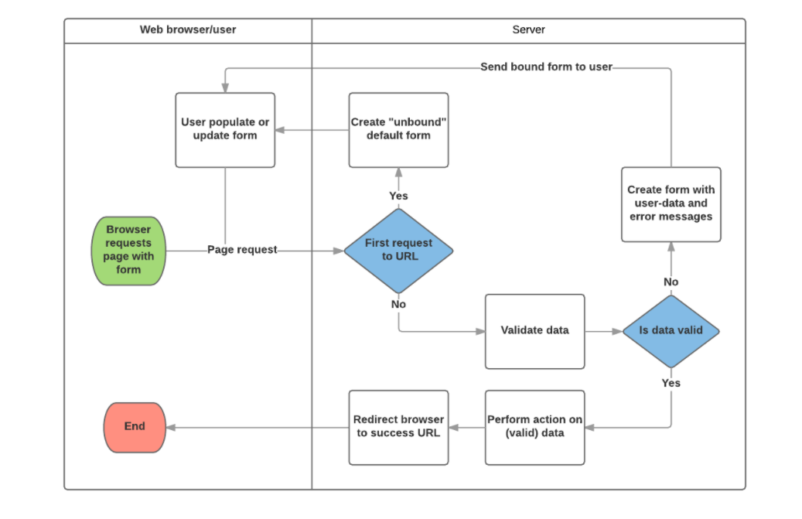

# Django Forms
- An HTML Form is a group of one or more fields/widgets on a web page, which can be used to collect information from users for submission to a server. Forms are a flexible mechanism for collecting user input because there are suitable widgets for entering many different types of data, including text boxes, checkboxes, radio buttons, date pickers and so on. Forms are also a relatively secure way of sharing data with the server, as they allow us to send data in POST requests with cross-site request forgery protection.

- While we haven't created any forms in this tutorial so far, we've already encountered them in the Django Admin site — for example, the screenshot below shows a form for editing one of our Book models, comprised of a number of selection lists and text editors

## Django form handling process
- Django's form handling uses all of the same techniques that we learned about in previous tutorials (for displaying information about our models): the view gets a request, performs any actions required including reading data from the models, then generates and returns an HTML page (from a template, into which we pass a context containing the data to be displayed). What makes things more complicated is that the server also needs to be able to process data provided by the user, and redisplay the page if there are any errors.

-  process flowchart of how Django handles form requests is shown below, starting with a request for a page containing a form (shown in green).
- 

### Form
- The Form class is the heart of Django's form handling system. It specifies the fields in the form, their layout, display widgets, labels, initial values, valid values, and (once validated) the error messages associated with invalid fields. The class also provides methods for rendering itself in templates using predefined formats (tables, lists, etc.) or for getting the value of any element (enabling fine-grained manual rendering).

### Declaring a Form
- The declaration syntax for a Form is very similar to that for declaring a Model, and shares the same field types (and some similar parameters). This makes sense because in both cases we need to ensure that each field handles the right types of data, is constrained to valid data, and has a description for display/documentation.

- Form data is stored in an application's forms.py file, inside the application directory. Create and open the file locallibrary/catalog/forms.py. To create a Form, we import the forms library, derive from the Form class, and declare the form's fields. A very basic form class for our library book renewal form is shown below — add this to your new file:
```
from django import forms

class RenewBookForm(forms.Form):
    renewal_date = forms.DateField(help_text="Enter a date between now and 4 weeks (default 3).")
```