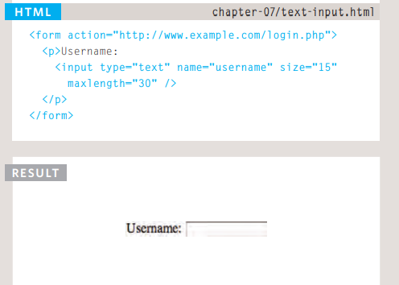

# What's a Table?
## - A table represents information in a grid format. The <table> element is used to create a table. The contents of the table are written out row by row. 
## -You indicate the start of each row using the opening <tr> tag. (The tr stands for table row.) It is followed by one or more <td> elements (one for each cell in that row). 
## -The <th> element is used just like the <td> element but its purpose is to represent the heading for either a column or a row. (The th stands for table heading.) example below:

```

<table>
 <tr>
 <th></th>
 <th scope="col">Saturday</th>
 <th scope="col">Sunday</th>
 </tr>
 <tr>
 <th scope="row">Tickets sold:</th>
 <td>120</td>
 <td>135</td>
 </tr>
 <tr>
 <th scope="row">Total sales:</th>
 <td>$600</td>
 <td>$675</td>
 </tr>
</table>

```
# Form Controls
## - There are several types of form controls that you can use to collect information from visitors to your site. it works like a user fills in a form and then presses a button to submit the information to the server



# CREATE & ACCESS OBJECTS CONSTRUCTOR NOTATION
## - below, an empty object called hote 1 is created using the onstructor function. Once it has been created, three properties and a method are then assigned to the object. To access a property of this object, you can use dot notation, just as you can with any object

```
var hotel = new Object(); 
hotel.name= 'Park'; 
hotel.rooms = 120; 
hotel .booked = 77; 
hotel .checkAvailability = function() 
return this.rooms - this.booked; 
} ; 
JAVASCRIPT 
var elName = document.getElementByid('hotelName'); 
elName.textContent = hotel . name; 
var elRooms = document .getElementByid('rooms'); 
elRooms.textContent = hotel .checkAvailability(};

```

## THIS (IT IS A KEYWORD)
### -  The keyword this is commonly used inside functions and objects. Where the function is declared alters what this means. It always refers to one object, usually the object in which the function operates. 
### 


