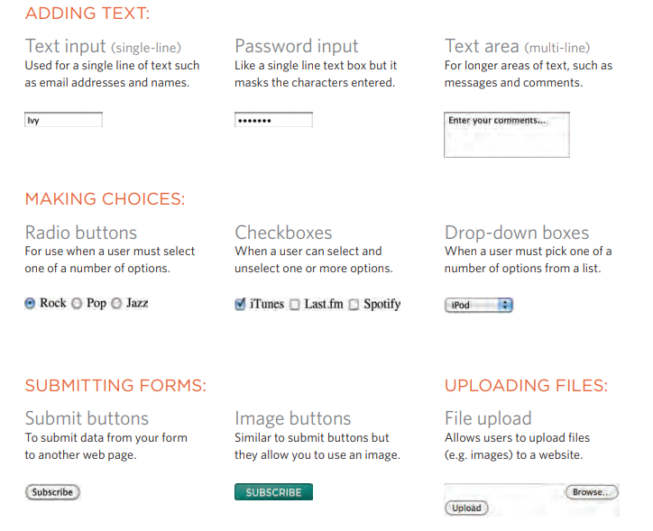
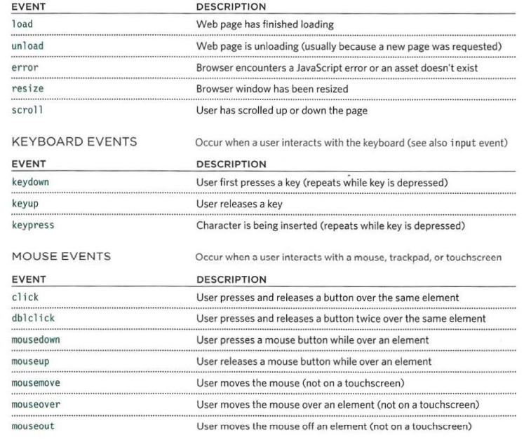

## Why forms ?
### - n to enabling users to search, forms also allow users to perform other functions online. You will see forms when registering as a member of a website, when shopping online, and when signing up for newsletters or mailing lists.
### -There are several types of form controls that you can use to collect information from visitors to your site. examples of forms shown below:

### - forms works while A user fills in a form and then presses a button to submit the information to the server
### we can use username,passwords and everything you type as an input as below:

```

<form action="http://www.example.com/login.php">
<p>Username:
 <input type="text" name="username" size="15" 
 maxlength="30" />
</p>
<p>Password:
 <input type="password" name="password" size="15" 
 maxlength="30" />
</p>
</form>

```

## EVENTS
### - When you browse the web, your browser registers different types of events. It's the browser's way of saying, "Hey, this just happened." Your script can then respond to these events. 
### - here is a selection of the events that occur in the browser while you are browsing the web. Any of these events can be used to trigger a function in your JavaScript code. examples of events shown below:
 
 

